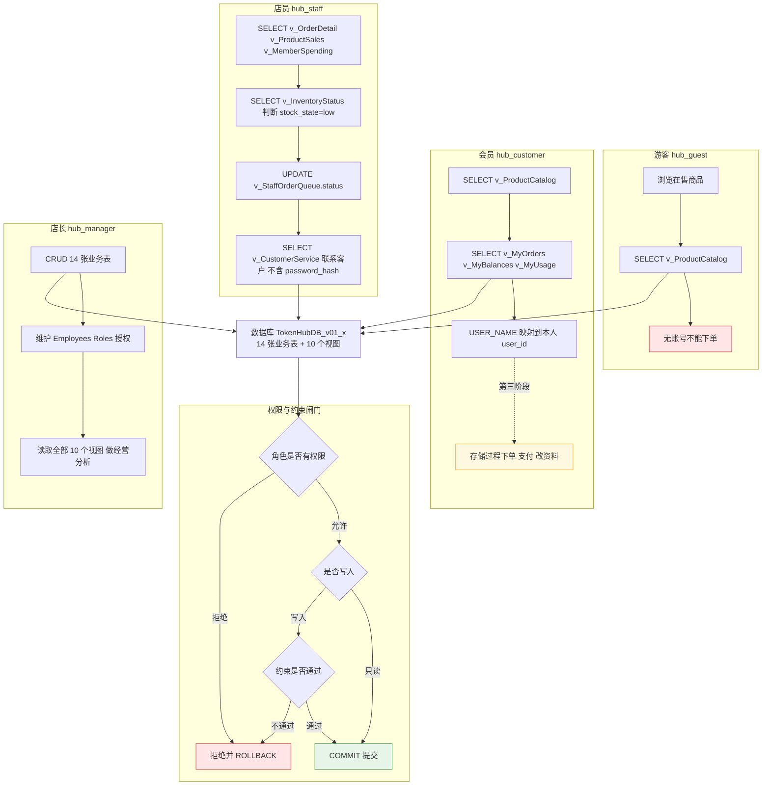
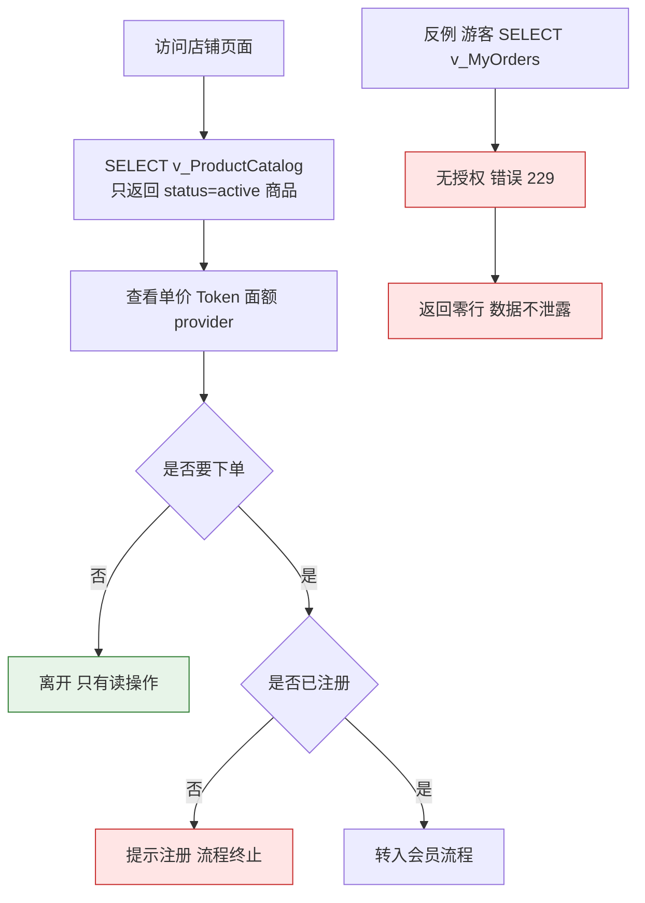
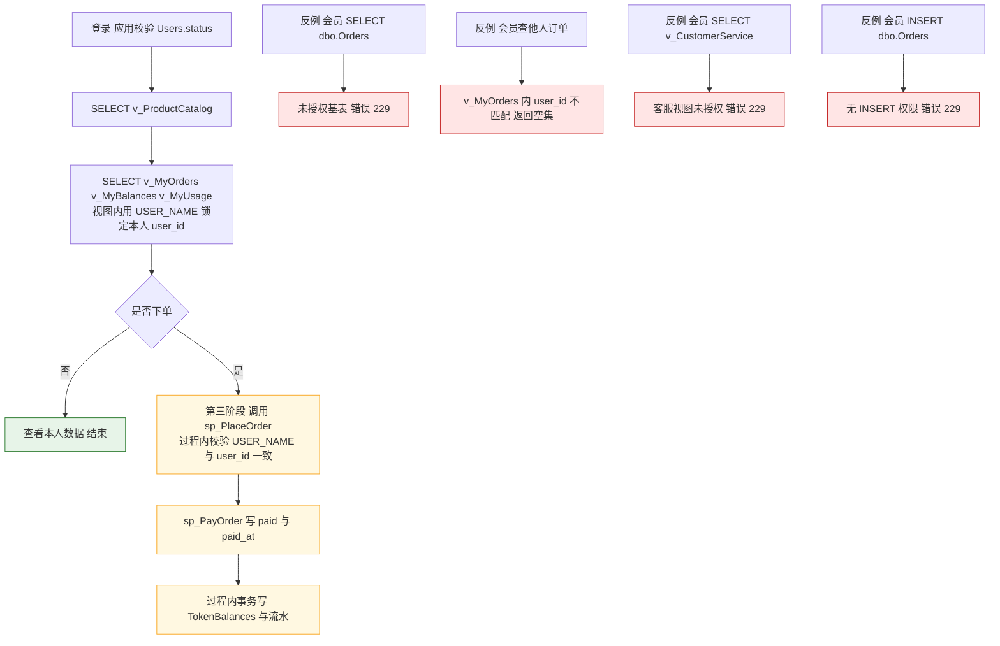
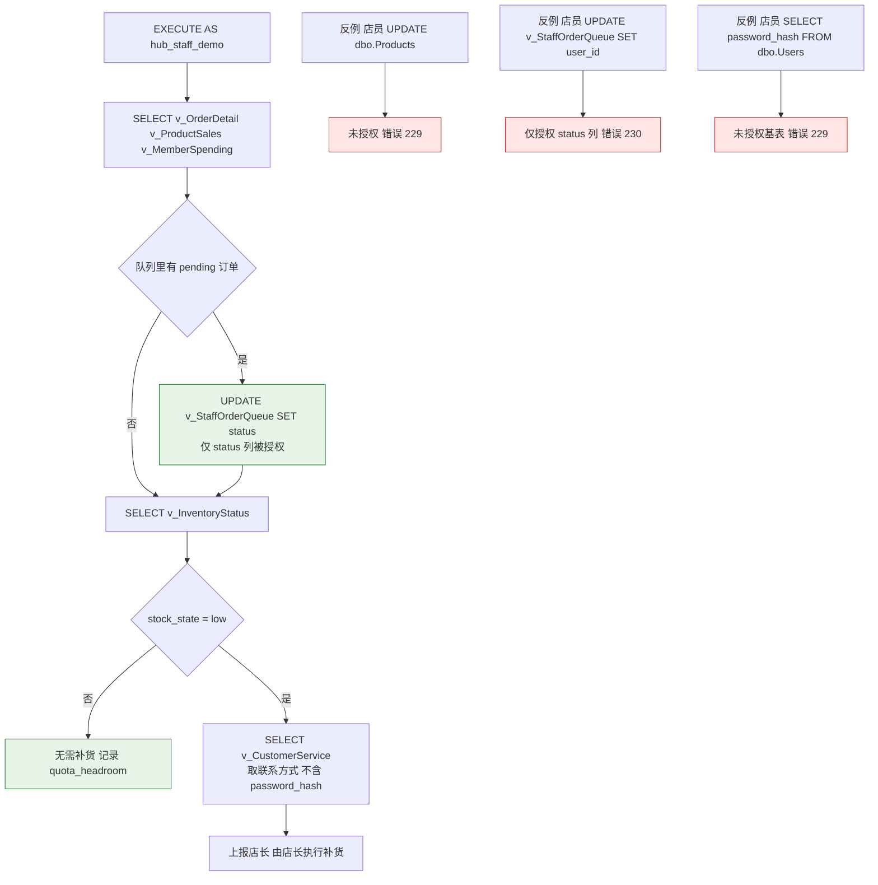
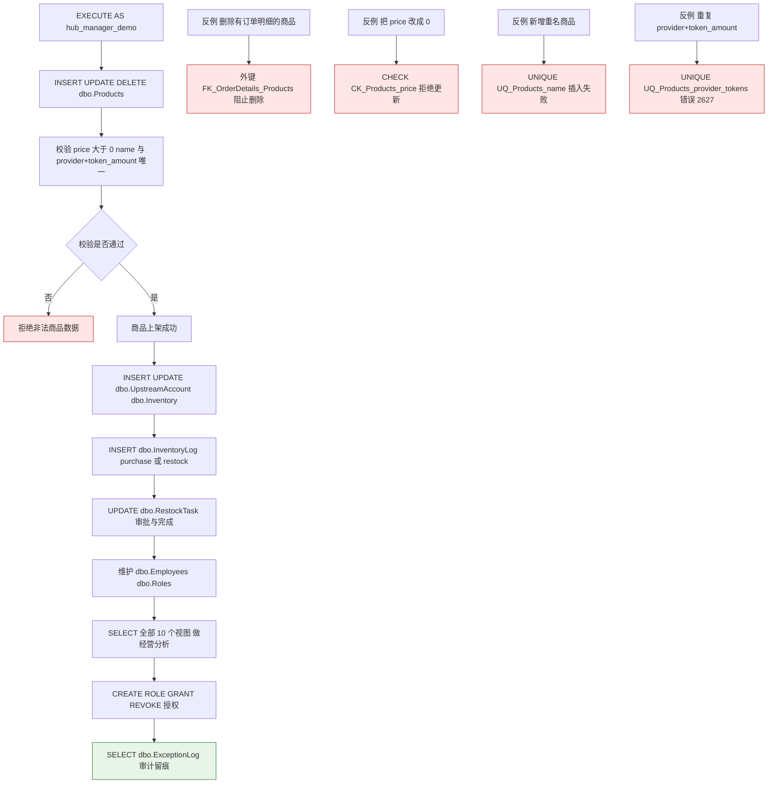

# v0.1 角色—数据库操作流程图

> 场景：API Token 中转站　数据库：`TokenHubDB_v01_*`
> 配套脚本：`sql/role.sql`、`sql/view.sql`、`sql/query.sql`、`sql/constraint.sql`
> 本图与 `sql/role.sql` 的实际授权一一对应；会员写操作推迟到第三阶段存储过程，原因见文末。

## 0. 角色与数据库身份

| 业务角色 | SQL Server 角色 | 演示用户（WITHOUT LOGIN） | 职责范围 |
|---|---|---|---|
| 游客 | `hub_guest` | `hub_guest_demo` | 只读在售商品目录 |
| 会员 | `hub_customer` | `hub_user_1`、`hub_user_2` | 本人订单、余额、用量 |
| 店员（客服/运营） | `hub_staff` | `hub_staff_demo` | 经营视图、订单状态处理、客服信息查询 |
| 店长（管理员） | `hub_manager` | `hub_manager_demo` | 14 张业务表 CRUD、员工角色、经营分析 |

> `dbo.Roles` 是应用层角色描述数据，`hub_guest/hub_customer/hub_staff/hub_manager` 才是 SQL Server DATABASE ROLE，两者分开设计。

## 1. 总图：四个角色到数据库的完整链路

## 2. 子流程一：游客（`hub_guest`）

## 3. 子流程二：会员（`hub_customer`）

## 4. 子流程三：店员（`hub_staff`）

## 5. 子流程四：店长（`hub_manager`）

## 6. 角色—权限矩阵

| 对象与操作 | 游客 `hub_guest` | 会员 `hub_customer` | 店员 `hub_staff` | 店长 `hub_manager` |
|---|:---:|:---:|:---:|:---:|
| `v_ProductCatalog` 读 | 读 | 读 | 读 | 读 |
| `v_OrderDetail` / `v_ProductSales` / `v_MemberSpending` 读 | — | — | 读 | 读 |
| `v_InventoryStatus` 读 | — | — | 读 | 读 |
| `v_CustomerService` 读（联系方式，无密码哈希） | — | — | 读 | 读 |
| `v_StaffOrderQueue` 读 | — | — | 读 | 读 |
| `v_StaffOrderQueue.status` 更新 | — | — | 仅此列 | 允许 |
| `v_MyOrders` / `v_MyBalances` / `v_MyUsage` 读 | — | 仅本人 | — | —（改读基表） |
| 14 张基表 SELECT | — | — | — | 允许 |
| 14 张基表 INSERT / UPDATE / DELETE | — | — | — | 允许 |
| 下单 / 支付 / 改本人资料 | — | 第三阶段存储过程 | — | 允许 |
| 补货 `RestockTask` / 库存写入 | — | — | 仅上报 | 允许 |
| `Users.password_hash` 读取 | — | — | — | 允许（基表 CRUD） |
| DDL / CONTROL / db_owner / sysadmin | — | — | — | — |

`verify.sql` VFY03 会自动复核该矩阵：会员与游客不得拥有任何写权限，会员与店员不得拥有任何基表权限，店长对 14 张表的 CRUD 授权必须齐全。

## 7. `role.sql` 执行顺序

1. `CREATE ROLE hub_manager / hub_staff / hub_customer / hub_guest`（已存在则跳过，可重复执行）；
2. `CREATE USER hub_*_demo / hub_user_1 / hub_user_2 ... WITHOUT LOGIN`，用于课程内 `EXECUTE AS` 演示，不写真实登录；
3. `ALTER ROLE ... ADD MEMBER` 只把演示用户加入对应角色，不建立任何固定高权限成员关系；
4. 按最小权限逐对象 `GRANT SELECT`，只对队列视图的 `status` 列 `GRANT UPDATE`，不使用 `GRANT ALL`；
5. 用表驱动用例 R01～R17 逐条执行正反例：正例必须执行成功，非法例必须匹配指定错误号（229/230）；
6. 追加 `sys.fn_my_permissions` 审计输出，列出店员在视图与基表上的实际权限，并校验店长管理权限；
7. 断言会员与店员在基表上没有权限、店长 CRUD 覆盖 14 张表、public 没有业务对象授权。

会员写权限为什么不在本阶段实现：见阶段报告的当前局限及本文件权限矩阵。直接授予 `INSERT ON Orders` 会让会员绕过“订单汇总 = 明细之和”“支付时间一致性”和 `USER_NAME()` 与目标 `user_id` 的比对；因此 v0.1 交付会员只读能力，下单、支付、修改本人资料统一由第三阶段存储过程在同一事务内完成并校验调用者身份。