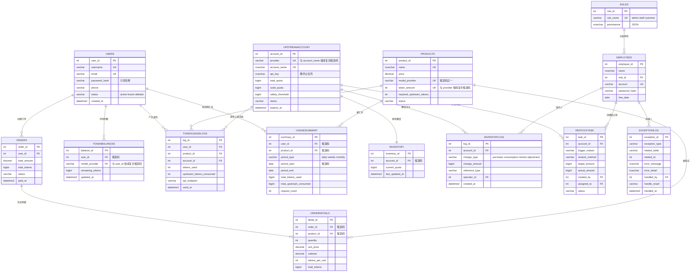

# 第一阶段 v0.1 阶段报告

> 项目：API Token 中转站数据库　阶段：第一阶段（v0.1）
> 环境：SQL Server 2025 Express 17.0.1000.7 / `localhost\SQLEXPRESS` / Windows 身份验证
> 正式脚本：[`sql/`](../sql/README.md)　复现入口：[`tools/run_v01.ps1`](../tools/run_v01.ps1)

## 一、设计思路

### 1. 经营场景与业务流程

本项目模拟 API Token 中转站。平台向用户销售不同 AI provider 的 Token 套餐，用户支付后获得对应模型余额，之后通过平台调用 API；平台从上游账号额度中提供服务，并记录库存、库存流水、使用量、补货和异常。

核心闭环：

```text
浏览商品 → 创建订单 → 支付 → 增加用户 Token 余额
→ API 调用 → 扣减用户余额和上游库存
→ 记录调用日志/库存流水 → 统计汇总 → 低库存补货/异常处理
```

经营角色包括店长、店员、会员和游客。店长负责商品、库存、订单和经营分析；店员读取经营数据、通过工作队列切换订单状态并联系客户；会员只能访问商品和本人业务数据；游客只浏览在售商品。

销售统计统一只计算 `Orders.status='paid'`，历史销售额采用 `OrderDetails.subtotal` 的下单快照，不用当前商品价格重算历史订单。

### 2. 数据边界：哪些信息进入数据库，哪些暂不进入

进入数据库的信息包括：用户账户元数据、商品套餐、订单与明细、上游账号元数据、库存与库存流水、Token 余额、调用用量、日/周/月使用汇总、员工与角色、补货任务、异常处理结果。这些信息直接参与交易、额度控制、审计或经营分析。

暂不进入数据库的信息包括：用户密码明文、真实 API Key、Prompt 与完整 API 请求/响应、第三方支付详细流水、设备/IP、图片文件等。原因分别是安全、隐私、课程范围和存储成本。本项目只保存密码哈希；样例 API Key 使用 `DEMO_NOT_A_REAL_API_KEY_*` 明确占位符。

真实注册、支付、退款、充值、补货事务、并发控制和应用登录映射也暂不作为 v0.1 的完整业务事务实现，它们属于后续阶段。

### 3. 表设计、主码、候选码与外码

14 张表按“业务实体有独立身份、关系通过外键表达、天然唯一属性使用候选码”设计。核心键如下：

| 表 | 主码 | 主要候选码 | 主要外码 |
|---|---|---|---|
| Users | `user_id` | `username`、`email` | 无 |
| Products | `product_id` | `name`、(`model_provider`,`token_amount`) | 无 |
| UpstreamAccount | `account_id` | (`provider`,`account_name`) | 无 |
| Inventory | `inventory_id` | `account_id` | `account_id → UpstreamAccount` |
| InventoryLog | `log_id` | 无 | `account_id → UpstreamAccount`、`operator_id → Employees` |
| Orders | `order_id` | 无 | `user_id → Users` |
| OrderDetails | `detail_id` | (`order_id`,`product_id`) | `order_id → Orders`、`product_id → Products` |
| Employees | `employee_id` | `account` | `role_id → Roles` |
| Roles | `role_id` | `role_name` | 无 |
| TokenBalances | `balance_id` | (`user_id`,`model_provider`) | `user_id → Users` |
| TokenUsageLogs | `log_id` | 无 | `user_id → Users`、`product_id → Products`、`account_id → UpstreamAccount` |
| UsageSummary | `summary_id` | (`user_id`,`product_id`,`period_type`,`period_start`) | `user_id → Users`、`product_id → Products` |
| RestockTask | `task_id` | 无 | `account_id → UpstreamAccount`、`created_by/assigned_to → Employees` |
| ExceptionLog | `exception_id` | 无 | `handled_by → Employees` |

主码统一使用整数 ID，便于连接、索引和固定样例数据复现；候选码用于约束现实世界中应唯一的用户名、邮箱、员工账号、角色名和账号/套餐组合；外码保证订单、库存、使用记录等不能指向不存在的实体。

`Inventory` 关联 `UpstreamAccount` 而不是 `Products`，因为库存表示的是“上游账号还剩多少可用 Token”，产品只是销售层套餐。`Orders.total_tokens` 与 `OrderDetails.total_tokens` 是受控冗余：前者是订单汇总，后者是明细分项，`verify.sql` 会逐订单核对两者一致。

字段类型的选择也有明确理由：金额一律用 `DECIMAL(10,2)` 而非 `FLOAT`，避免浮点近似误差累积；中文业务文本（商品名、错误描述、员工姓名）用 `NVARCHAR`；时间戳统一 `DATETIME2(0)`；`Roles.permissions` 用 `NVARCHAR(MAX)` 承载 JSON 并配 `ISJSON` CHECK；`password_hash` 定长 60 字符以容纳真实 bcrypt 格式；API Key 列存 `DEMO_NOT_A_REAL_API_KEY_*` 占位符，真实密钥不入库。

### 4. 实体关系图

由 [`sql/01_create_tables.sql`](../sql/01_create_tables.sql) 生成，列出主码、外码与候选码，业务字段只保留代表性列。



关系基数与语义：

| 关系 | 基数 | 说明 |
|---|---|---|
| `UPSTREAMACCOUNT` → `INVENTORY` | 1 : 1 | `Inventory.account_id` 是候选码，一个上游账号只有一条库存记录；库存表示上游账号剩余可用 Token，不是商品件数 |
| `ORDERS` → `ORDERDETAILS` | 1 : N | 一个订单至少一条明细；`(order_id, product_id)` 是候选码，同一订单不重复出现同一商品 |
| `USERS` → `TOKENBALANCES` | 1 : N | 一个会员按 `model_provider` 持有多条余额，复合候选码 `(user_id, model_provider)` |
| `USERS`/`PRODUCTS` → `USAGESUMMARY` | 1 : N | 汇总粒度为用户 × 商品 × 周期类型 × 周期起点，用于经营统计与后续预测 |
| `TOKENUSAGELOGS` | 多外码 | 一次调用同时关联会员、商品和提供服务的上游账号，是调用量与上游消耗对账的枢纽 |
| `EMPLOYEES` → `INVENTORYLOG` / `RESTOCKTASK` / `EXCEPTIONLOG` | 1 : N | 员工操作留痕；`operator_id`、`created_by/assigned_to`、`handled_by` 均可为空，表示系统自动写入 |

冗余与对账关系：`Orders.total_tokens = SUM(OrderDetails.total_tokens)`、`Orders.total_amount = SUM(OrderDetails.subtotal)`（同一订单内）、`Inventory.current_quota = UpstreamAccount.total_quota - used_quota = SUM(InventoryLog.change_amount)`。这三项由 [`sql/verify.sql`](../sql/verify.sql) 的 VFY02、VFY05、VFY09 逐条对账，任何一项不一致都会让流水线以非零退出码失败。

### 5. 完整性约束设计

本阶段同时使用实体完整性、参照完整性、域完整性和跨列业务约束：

| 约束类型 | 作用 | 代表约束 |
|---|---|---|
| PK / UNIQUE | 实体与候选码唯一 | `PK_Orders`、`UQ_Users_username`、`UQ_Users_email`、`UQ_Products_name`、`UQ_Products_provider_tokens`、`UQ_OrderDetails_order_product`、`UQ_TokenBalances_user_provider`、`UQ_Inventory_account`、`UQ_UpstreamAccount_provider_name`、`UQ_UsageSummary_key` |
| FK | 引用真实父实体 | `FK_Orders_Users`、`FK_OrderDetails_Products`、`FK_Inventory_UpstreamAccount`、`FK_TokenUsageLogs_Account`、`FK_RestockTask_CreatedBy` |
| NOT NULL / DEFAULT | 必要字段与稳定初态 | `Orders.status DEFAULT 'pending'`、`Products.status DEFAULT 'active'`、`Users.created_at DEFAULT SYSDATETIME()` |
| CHECK（域） | 价格、数量、枚举、JSON、非负额度 | `CK_Products_price`、`CK_Users_status`、`CK_Roles_permissions_json`、`CK_Inventory_current_quota`、`CK_TokenBalances_remaining` |
| CHECK（跨列） | 第四周新增 3 个 | `CK_OrderDetails_subtotal_formula`、`CK_OrderDetails_tokens_formula`、`CK_Orders_payment_time` |

三个跨列 CHECK 覆盖了原先只能靠应用层保证的业务不变量：

- `CK_OrderDetails_subtotal_formula`：`subtotal = quantity * unit_price`
- `CK_OrderDetails_tokens_formula`：`total_tokens = quantity * tokens_per_unit`
- `CK_Orders_payment_time`：`status = 'paid'` 时 `paid_at` 必填

订单头与明细汇总、上游账号与库存与流水属于跨表规则，普通 CHECK 无法直接可靠表达（CHECK 只能引用同表列，且子查询不受支持），因此通过 `verify.sql` 独立对账，并留给后续事务阶段用触发器或存储过程维护。

#### 正反例：`constraint.sql` 的 C01～C14

用例驱动器在事务中执行每条语句，捕获实际错误号与报错文本，只有**错误号匹配且报错文本包含预期约束名**才算 PASS，避免“只要报错就算成功”。合法用例（C01、C02）在事务中验证 DEFAULT 生效后回滚。

| 用例 | 类型 | 操作 | 预期错误号 | 命中约束 |
|---|---|---|---|---|
| C01 | 正例 | 插入商品，省略 `status`/`description` | 无（断言 `status='active'`、`created_at` 非空、`description` 为 NULL） | DEFAULT |
| C02 | 正例 | 插入订单，省略 `status`/`paid_at` | 无（断言 `status='pending'`、`paid_at` 为 NULL） | DEFAULT |
| C03 | 反例 | `IDENTITY_INSERT ON` 后插入重复 `order_id=1` | 2627 | `PK_Orders` |
| C04 | 反例 | 插入已存在的 `username='user001'` | 2627 | `UQ_Users_username` |
| C05 | 反例 | 插入 `user_id=999999` 的订单 | 547 | `FK_Orders_Users` |
| C06 | 反例 | 插入 `price=-1` 的商品 | 547 | `CK_Products_price` |
| C07 | 反例 | 插入 `name=NULL` 的商品 | 515 | NOT NULL（不指定约束名） |
| C08 | 反例 | 把 `OrderDetails.subtotal` 加 0.01 | 547 | `CK_OrderDetails_subtotal_formula` |
| C09 | 反例 | 把 `OrderDetails.total_tokens` 加 1 | 547 | `CK_OrderDetails_tokens_formula` |
| C10 | 反例 | 把一个 `paid` 订单的 `paid_at` 置 NULL | 547 | `CK_Orders_payment_time` |
| C11 | 反例 | 删除仍有订单的用户 `user_id=1` | 547 | FK（参照完整性，不指定约束名） |
| C12 | 反例 | 复制商品但保持 `model_provider`+`token_amount` 相同 | 2627 | `UQ_Products_provider_tokens` |
| C13 | 反例 | 复制同一订单的同一商品明细行 | 2627 | `UQ_OrderDetails_order_product` |
| C14 | 反例 | 把 `staff` 角色的 `permissions` 改成 `'not-json'` | 547 | `CK_Roles_permissions_json` |

C12～C14 是本轮补充的三个反例，用来证明候选码与 JSON 域约束确实生效：仅靠“有约束”无法说明约束有效，只有实际触发并命中指定约束名才算验证通过。

### 6. 角色与权限划分及正反例

数据库层使用四个 SQL Server DATABASE ROLE，遵循最小权限原则：

| 角色 | 允许 | 明确禁止 |
|---|---|---|
| `hub_manager` | 14 张业务表 CRUD、全部视图 | CREATE TABLE、CONTROL、db_owner、sysadmin |
| `hub_staff` | 经营视图（订单明细、销量、会员消费、库存、客服视图）；仅更新 `v_StaffOrderQueue.status` | 直接改商品价格、任意基表 CRUD、读取 `dbo.Users` 密码哈希 |
| `hub_customer` | 商品目录、本人订单/余额/用量 | 读取 Orders/TokenBalances/UpstreamAccount/Users 等基表、读取客服视图 |
| `hub_guest` | 在售商品目录 | 订单和个人数据 |

#### 正反例：`role.sql` 的 R01～R17

同样在事务中以 `EXECUTE AS` 切换到对应数据库用户执行，断言权限行为而不是只看是否报错。

| 用例 | 执行身份 | 类型 | 操作 | 预期 |
|---|---|---|---|---|
| R01 | `hub_guest_demo` | 正例 | 读 `v_ProductCatalog` | 成功，返回 10 行 |
| R02 | `hub_guest_demo` | 反例 | `SELECT order_id FROM dbo.Orders` | 拒绝，错误 229 |
| R03 | `hub_staff_demo` | 正例 | 读 `v_OrderDetail` | 成功，返回 184 行 |
| R04 | `hub_staff_demo` | 反例 | `UPDATE dbo.Products SET price=price+1` | 拒绝，错误 229（店员不得改价） |
| R05 | `hub_staff_demo` | 正例 | 经 `v_StaffOrderQueue` 把 pending 订单改 cancelled | 成功，且 `@@ROWCOUNT=1` |
| R06 | `hub_user_1` | 正例 | 读 `v_MyOrders` | 成功，13 行且全部 `user_id=1` |
| R07 | `hub_user_2` | 正例 | 读 `v_MyOrders` | 成功，15 行且全部 `user_id=2` |
| R08 | `hub_user_1` | 反例 | `SELECT order_id FROM dbo.Orders` | 拒绝，错误 229 |
| R09 | `hub_user_1` | 反例 | `SELECT api_key FROM dbo.UpstreamAccount` | 拒绝，错误 229 |
| R10 | `hub_user_1` | 正例 | 断言看不到他人数据 | `v_MyOrders` 无 `user_id=2`；`v_MyBalances`/`v_MyUsage` 非空且均属本人 |
| R11 | `hub_manager_demo` | 正例 | `UPDATE dbo.Products SET price=price+1` | 成功，且 `@@ROWCOUNT=1` |
| R12 | `hub_manager_demo` | 反例 | 检查 `HAS_PERMS_BY_NAME` 是否含 `CREATE TABLE`/`CONTROL` | 断言两项均为否（店长不是高权限角色） |
| R13 | `hub_staff_demo` | 反例 | `UPDATE dbo.v_StaffOrderQueue SET user_id=...` | 拒绝，错误 230（无该列的 UPDATE 权限） |
| R14 | `hub_staff_demo` | 正例 | 读 `v_CustomerService` | 成功，40 行；视图不含 `password_hash`/`api_key` |
| R15 | `hub_staff_demo` | 反例 | `SELECT password_hash FROM dbo.Users` | 拒绝，错误 229（客服必须走不含密码哈希的视图） |
| R16 | `hub_user_1` | 反例 | `SELECT email FROM dbo.v_CustomerService` | 拒绝，错误 229（会员看不到他人联系方式） |
| R17 | `hub_manager_demo` | 正例 | 读 `v_CustomerService` | 成功，40 行 |

这组正反例覆盖了三层边界：角色之间的横向隔离（R02/R08/R09/R16）、同一角色内部的权限粒度（R04 与 R11 对比商品改价、R05 与 R13 对比队列视图的列级授权、R14 与 R15 对比客服视图与基表）、以及角色自身的权限上界（R12 证明店长没有被授予 DDL 或 CONTROL）。R05 与 R13 是最能说明列级授权的一对：店员能改 `v_StaffOrderQueue.status`，但改 `user_id` 会被 230 拒绝。

会员隔离不依赖调用者可随意设置的变量，而是让数据库用户 `hub_user_1` / `hub_user_2` 通过 `USER_NAME()` 映射到业务用户 1 / 2，并且不向会员开放相关基表 SELECT。

**为什么 v0.1 不给会员开下单/支付写权限。** 第一周的经营流程里会员可以下单、支付并修改本人资料，但 v0.1 是数据原型而不是应用：直接 `GRANT INSERT ON Orders TO hub_customer` 会让任何会员都能给任意 `user_id` 建单，绕过订单汇总、Token 换算和支付时间规则。因此会员写操作统一放到第三阶段的存储过程（`sp_PlaceOrder`、`sp_PayOrder`、`sp_UpdateProfile`、`sp_RestockOrder`），由过程内部校验 `USER_NAME()` 与目标 `user_id` 一致并在同一事务内维护余额与流水。本阶段只交付会员只读能力，写能力作为已知差异写在本报告第 2 节和 `report/role_workflow.md`。

角色到数据库对象的完整链路见 [`role_workflow.md`](role_workflow.md)。

## 二、实验过程

### 1. 第 1～2 周：业务与模式设计

第 1 周确定 API Token 中转站经营场景、四类角色、交易闭环和数据边界。第 2 周把业务实体转成 14 张关系表，定义字段类型、主码、候选码、外码、样例元组和关系说明。

### 2. 第 3 周：DDL、样例数据与 CRUD

第三周使用 SQL Server 2025 Express 落地 14 张表。`datagen.py` 使用固定随机种子生成业务相关样例数据，并自检订单金额、Token、余额、库存和外键关系。商品、库存和订单均完成 INSERT / SELECT / UPDATE / DELETE，演示写操作最终回滚，不污染基线。

第三周的两个补充脚本在第四周并入正式流水线，对应关系如下：

| 第三周脚本 | v0.1 中的位置 | 变化 |
|---|---|---|
| `week3/sql/04_constraint_demo.sql` | `sql/constraint.sql` C05（负价格）、C06（非法 `Orders.user_id`） | 改为表驱动用例驱动器，逐条比对预期错误号与命中的约束名；并扩展到 C01～C14 |
| `week3/sql/05_consistency_check.sql` | `sql/verify.sql` VFY02、VFY05 | 订单汇总、库存与流水对账改用可参数化的 `USE [$(DatabaseName)]`；补足孤儿订单与余额对账 |
| `week3/sql/12_reproduction.sql` | `tools/run_v01.ps1` + `sql/signature.sql` | 全自动空库重建 + SHA-256 签名比较，替代人工比对 |

第三周遗留问题中，“`Orders` 缺 paid 与 `paid_at` 的列间 CHECK”已在第四周作为 `CK_Orders_payment_time` 落地；“一致性校验依赖内连接”已改为双向 `EXCEPT` 与视图/基表对账。

### 3. 第 4 周：查询与视图

`sql/query.sql` 实现 Q01～Q12，覆盖 INNER JOIN、LEFT JOIN、GROUP BY、HAVING、NOT EXISTS、CTE、子查询与按 provider 聚合。关键实测结果：

- Q01 订单明细 184 行；Q02 已支付商品 10 个、总件数 191、销售额 4228.90；Q05 找出 14 个没有 paid 订单的会员；Q04 有 13 人消费至少 100 元。
- Q09 在事务内临时插入一个阈值边界账号，`v_InventoryStatus` 立刻把它判为 `stock_state='low'`，随后回滚，基线数据不变。
- Q10 用同一份聚合结果对照两种连接写法：商品 INNER/LEFT 都是 10 行（样例数据里每个商品都有销量），会员 INNER 是 26 行、LEFT 是 40 行，直观说明 INNER JOIN 会丢掉没有 paid 订单的会员。
- Q11 从 `UsageSummary` 汇总日粒度与月粒度用量；Q12 按上游账号统计消耗/采购/补货净额，消耗合计 7248120 与 `TokenUsageLogs.upstream_tokens` 一致。

`sql/view.sql` 创建 10 个视图：4 个经营统计视图（`v_OrderDetail` 184 行、`v_ProductSales` 10 行、`v_MemberSpending` 40 行、`v_InventoryStatus` 8 行）、商品目录 `v_ProductCatalog`、客服视图 `v_CustomerService`（40 行）、会员隔离视图 `v_MyOrders`/`v_MyBalances`/`v_MyUsage`、店员工作队列 `v_StaffOrderQueue`。

`v_InventoryStatus` 把“账号可用性”和“额度水位”拆成两个字段：`account_state`（usable/unusable，考虑 `status` 与 `expires_at`）和 `stock_state`（low/normal，只比较 `current_quota` 与 `safety_threshold`），并给出 `quota_headroom`。拆分的原因是早期版本用单个 `stock_state` 混装状态值，账号过期会把“低库存”显示成“过期”，补货判断会被误导。

### 4. 第 4 周：约束与权限

`constraint.sql` 先盘点现有约束，再新增 3 个跨列 CHECK，并通过 C01～C14 逐条执行正反例。只有错误号和必要的约束名符合预期才算 PASS，避免“只要报错就算成功”。C12/C13/C14 覆盖候选码与域约束的反例：重复的 (`model_provider`,`token_amount`) 返回 2627、同一订单重复商品行返回 2627、非法 JSON 权限串返回 547。

`role.sql` 创建 4 个数据库角色和 5 个 WITHOUT LOGIN 演示用户，逐项执行 R01～R17。实际验证访客、店员、会员和店长的允许/禁止操作，并确认会员相互隔离、会员与店员没有基表权限、没有固定高权限角色成员关系、public 没有业务对象授权。

### 5. 综合验收与空库复现

`verify.sql` 执行 VFY01～VFY11：逐表行数、订单与库存总量、视图行数、会员集合、商品/会员视图逐行比对、余额逐用户/provider 对账、UsageSummary 三种粒度逐键比对，以及零销量/低库存边界正例。本轮补充的断言包括：低库存分类与基表推导结果必须一致且至少命中一行、`quota_headroom` 逐账号核对、会员与游客不得拥有任何写权限、会员与店员不得拥有任何基表权限、店长对 14 张表的 CRUD 授权必须齐全。

`tools/run_v01.ps1` 从空库按 `00 → 01 → 02 → 03 → view → query → constraint → role → verify → signature` 顺序执行（视图先于查询，Q09 才能引用视图）。

2026-10-01 在 `localhost\SQLEXPRESS` 实际构建 `TokenHubDB_v01_A`、`TokenHubDB_v01_B`、`TokenHubDB_v01_C` 三个全新数据库，三次均全项通过；`signature.sql` 对 14 张表完整内容计算 SHA-256，A/B/C 的 `signature.txt` 逐字节完全一致。本轮修订没有改动 `sql/01_create_tables.sql` 与 `sql/02_insert_data.sql`，只涉及视图、查询、约束用例、权限和验收脚本，因此 14 张基础业务表的数据口径保持不变。

### 6. 结果截图与证据

`result/screenshots/` 保存 12 张真实 SQL Server 执行截图，覆盖成功建库、三组 CRUD、多表查询、销售/会员统计、统计视图、合法与非法完整性用例、不同角色权限、会员隔离和 A/B 双空库签名比较。每张截图都可追溯到 `result/evidence_sql/` 和 `result/evidence_logs/`。

主流水线原始日志保存在 `result/run_A/`、`result/run_B/`、`result/run_C/`。第三周的人工测试记录以 PDF 形式保存在 `result/第3周人工测试演示结果.pdf`。截图和日志分别证明“结果可视化”和“执行过程可追溯”，避免只依赖单一证据。

## 三、实验总结

第一阶段 v0.1 已经把业务需求、关系模式、DDL/CRUD、查询、视图、完整性和权限串成一套可以从空数据库重复执行的原型。相较于仅验证 SQL 能运行，本阶段进一步使用自动断言、预期错误号、逐行/逐键对账和内容签名来验证结果是否正确。

实际最终状态：14 张业务表、10 个视图、4 个数据库角色、5 个演示用户、3 个第四周新增跨列 CHECK；已支付订单 85 个，已支付销售额 4228.90，已支付 Token 92950000。Q01～Q12、C01～C14、R01～R17、VFY01～VFY11 均通过。

执行过程中实际发生的修正（均可在日志中复现）：

1. 权限异常在 `XACT_ABORT ON` 事务中需要先 ROLLBACK 再 REVERT，否则报 3930；修正后 R 用例全部通过。
2. VFY06 原计划 CTE 后直接接 IF，在 SQL Server 中报 156 语法错误，改为表变量加双向 `EXCEPT` 后通过。
3. `signature.sql` 独立执行时无法确定目标库，补 `USE [$(DatabaseName)]`；该语句会让 `sqlcmd` 额外打印一行本地化的“更改了数据库上下文”提示，导致不同库名的签名文件无法直接比较，因此 `run_v01.ps1` 现在只保留 `表名|行数|哈希` 三段式行，签名文件可跨库名逐字节比较。
4. 早期 `v_InventoryStatus` 把账号状态写进 `stock_state`，低库存账号显示为“过期/耗尽”，Q06 结果恒为空；拆成 `account_state` 与 `stock_state` 后补货判断可依据 `quota_headroom`，并新增 Q09 边界用例。

当前局限：

- 数据是固定随机种子的合成数据，不代表真实客户或真实商业报价；库存状态使用固定样例快照 `2026-09-22 23:59:59`，不是实时监控。
- WITHOUT LOGIN 用户与 `USER_NAME()` 映射用于课程权限演示，不是生产级身份体系。
- 会员下单、支付与修改本人资料的真实注册/支付/退款/充值/补货事务和并发控制，需在第三阶段以存储过程实现。
- `result/screenshots/` 的 PNG 抓屏于 2026-09-30、修改前的脚本版本；本轮新增的 Q09～Q12、C12～C14、R14～R17 目前只有 `result/run_*/` 原始日志，没有对应截图。

总体上，v0.1 已满足第一阶段从“业务设计”到“可复现数据库原型”的目标，并为下一阶段事务、存储过程、并发控制和应用接入保留了稳定数据基线。

## 四、证据位置

| 内容 | 位置 |
|---|---|
| 第一、二周设计 | 过程材料 `week1 & 2/`（不随提交包提供） |
| 第三周历史实现 | 过程材料 `week3/`（不随提交包提供）；人工测试记录见 `result/第3周人工测试演示结果.pdf` |
| 第四周交付清单与实施计划 | 过程材料 `week4/week4_deliverables.md`、`week4/week4_plan.md` |
| 正式阶段 SQL | [`sql/`](../sql/README.md) |
| 自动运行与签名 | `result/run_A/`、`result/run_B/`、`result/run_C/` |
| 结果截图与证据 SQL | [`result/`](../result/README.md)、[`result/screenshots/`](../result/screenshots/README.md) |
| 角色权限流程图 | [`role_workflow.md`](role_workflow.md) |
| 实体关系图与知识导图 | 本报告第 1 节第 4、7 小节 |
| AI 使用记录 | [`ai_usage_log.md`](../ai_usage_log.md) |
| 分工记录 | [`team_division.md`](../team_division.md) |